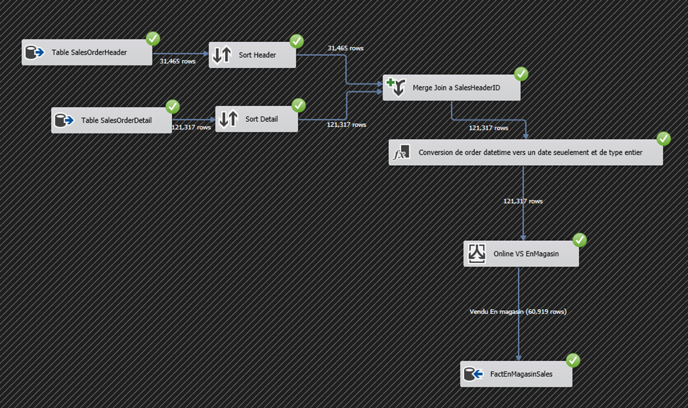
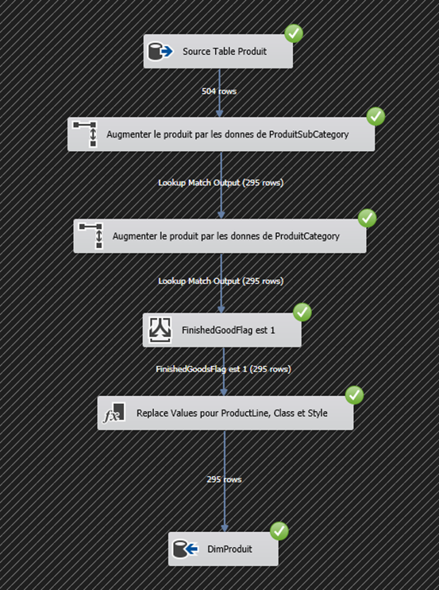
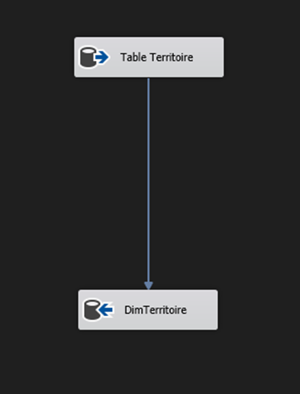
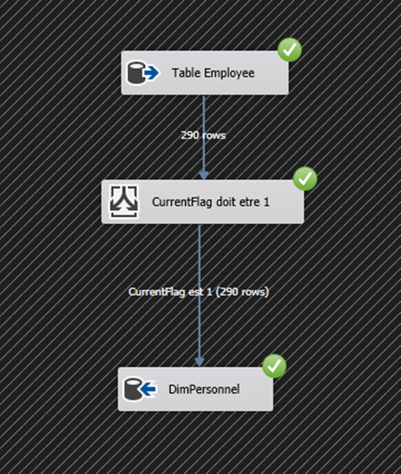
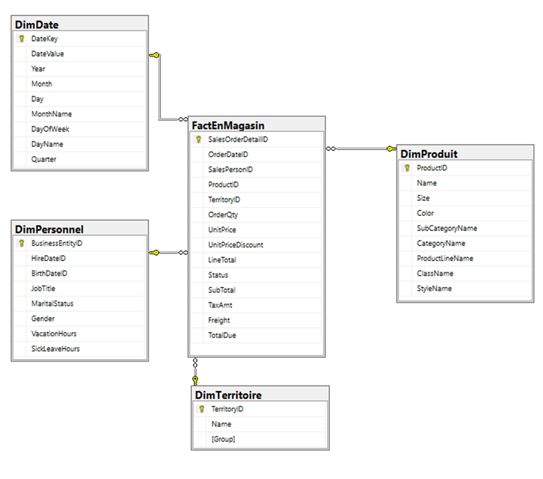
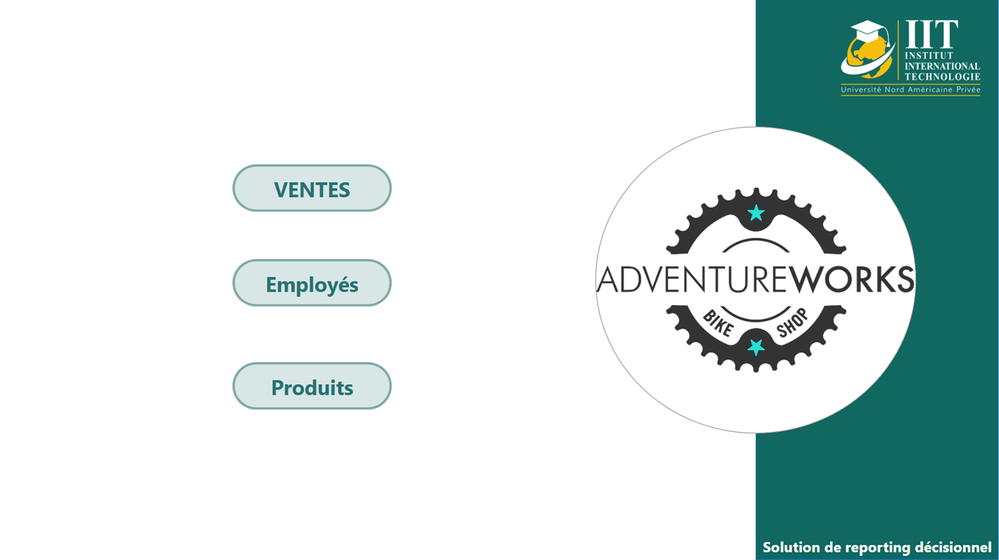
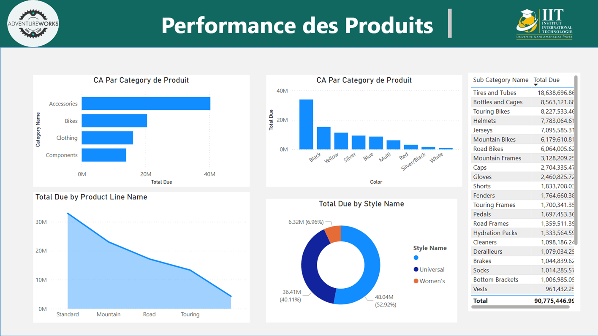
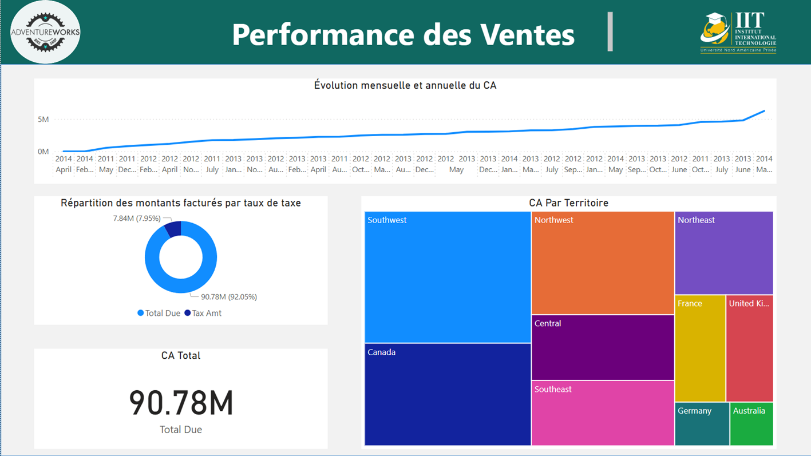
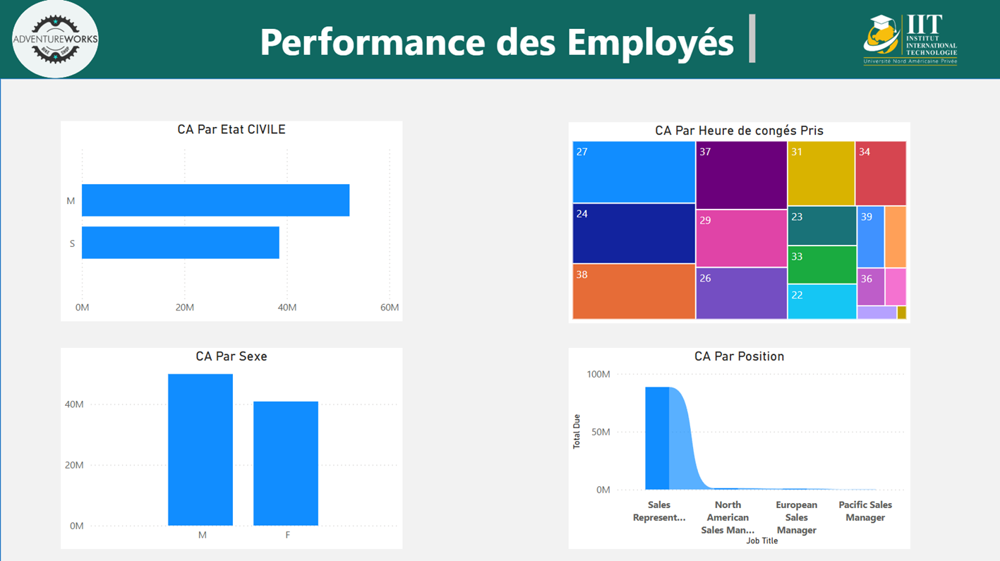

# 🚴‍♂️ Business Intelligence Solution for Adventure Works Cycles 🚴‍♀️

Welcome to our **end-to-end Business Intelligence (BI) project** for **Adventure Works Cycles**, a global leader in bicycle manufacturing! 🎉 This project, crafted by **Chedy Chaaben** and **Taieb Jemal** under the guidance of **Dr. Salma Dammak**, empowers data-driven decisions by analyzing **Sales**, **Products**, and **Employees** through a robust data warehouse, OLAP cube, and a stunning Power BI dashboard. 📊✨

## 📋 Project Overview

Adventure Works Cycles aims to transform its complex data into actionable insights. Our BI solution provides a seamless pipeline to track and analyze key business metrics, enabling smarter decisions for the future. 🧠💡

## ❓ Problem Statement

The company’s relational database is a treasure trove of data, but its complexity and size make SQL analysis a headache. 😓 The challenge? Simplifying data access and unlocking insights without getting lost in intricate tables.

## 🛠️ Our Solution

We built a **comprehensive BI pipeline** to tackle these challenges:

1. 🏬 **Data Warehouse**: A centralized hub for organized, analysis-ready data.
2. 📐 **OLAP Cube**: Multidimensional analysis for lightning-fast queries.
3. 📈 **Power BI Dashboard**: Interactive visualizations for intuitive reporting.

## 🗺️ Project Roadmap

### 1. 🔍 Source Database Analysis

We dove into the **Adventure Works database**, exploring key schemas:

- **Human Resources** 👥: Employee data.
- **Production** 🛠️: Product details.
- **Purchasing** 🛒: Procurement data (no attributes selected).
- **Sales** 💰: Sales order records.

### 2. ⚙️ ETL Process (Extraction, Transformation, Loading)

Using **SQL Server Integration Services (SSIS)** and **SQL**, we crafted a robust ETL pipeline to populate our data warehouse. Below are snapshots of the SSIS treatment processes for the fact and dimension tables:

  
*SSIS package for processing the FactEnMagasin table*

  
*SSIS package for processing the DimProduit dimension*

  
*SSIS package for processing the DimTerritory dimension*

  
*SSIS package for processing the DimPersonnel dimension*

- **Fact Table: FactEnMagasin** 📊
  - **Source**: `Sales.SalesOrderHeader`, `Sales.SalesOrderDetails`
  - **Primary Key**: `SalesOrderDetailsID`
  - **Foreign Keys**: `OrderDateID`, `SalesPersonID`, `ProductID`, `TerritoryID`
  - **Measures**: `OrderQty`, `UnitPrice`, `UnitPriceDiscount`, `LineTotal`, `Status`, `SubTotal`, `TaxAmt`, `Freight`, `TotalDue`
- **Dimension Tables** 🌟:
  - **DimProduit** 🚲
    - **Source**: `Production.Product`, `Production.ProductSubCategory`, `Production.ProductCategory`
    - **Primary Key**: `ProductID`
    - **Attributes**: `Name`, `Size`, `Color`, `SubCategoryName`, `ProductLineName`, `ClassName`, `StyleName`
  - **DimTerritory** 🌍
    - **Source**: `Sales.Territory`
    - **Primary Key**: `TerritoryID`
    - **Attributes**: `Name`, `Group`
  - **DimPersonnel** 👷‍♂️
    - **Source**: `HumanResources.Employee`
    - **Primary Key**: `PersonnelID`
    - **Attributes**: `HireDateID`, `BirthDateID`, `JobTitle`, `MaritalStatus`, `Gender`, `VacationHours`, `SickLeaveHours`
  - **DimDate** 📅
    - **Source**: SQL-generated
    - **Primary Key**: `DateKey`
    - **Attributes**: `DateValue`, `Year`, `Month`, `Day`, `MonthName`, `DayOfWeek`, `DayName`, `Quarter`

Below is the schema view of the data warehouse tables, showing the relationships between the fact and dimension tables:

  
*Schema of the data warehouse with FactEnMagasin and dimension tables*

### 3. 🧊 OLAP Cube Creation

We supercharged our analysis with a multidimensional **OLAP cube**:

- 📑 **Database Diagram**: Linked the fact table (`FactEnMagasin`) with dimension tables (`DimProduit`, `DimTerritory`, `DimPersonnel`, `DimDate`).
- 🛠️ **Cube Creation**: Built in **SQL Server Analysis Services (SSAS)**, selecting key attributes for flexible analysis.
- ⚠️ **Technical Hurdle**: Overcame SSAS connection issues with the data warehouse. 💪
- 🎯 **Result**: A powerful cube for slicing and dicing data with ease.

### 4. 🎨 Visualization

We created an **interactive Power BI dashboard** to bring data to life! 📉📈 It visualizes **Sales**, **Products**, and **Employee** metrics, making insights accessible and actionable. Below is a preview of the dashboard:

# Power BI Business Intelligence Dashboards

This repository contains a collection of interactive **Power BI dashboards** designed to provide actionable insights across key areas of a business including navigation, products, sales, and employee performance.

## 📊 Dashboards Overview

### 🧭 Navigation Page
  
*Interactive Power BI dashboard – Navigation Page for accessing various business insights.*

- Serves as the central hub for dashboard navigation.
- Provides quick links to individual reports on products, sales, and employees.

---

### 📦 Product Dashboard
  
*Interactive Power BI dashboard – Visualizing product performance and inventory metrics.*

- Displays key KPIs like product sales, stock levels, and product categories.
- Helps identify top-performing and underperforming products.

---

### 💰 Sales Dashboard
  
*Interactive Power BI dashboard – Tracking sales trends, revenue, and regional performance.*

- Provides insights into sales over time, segmented by region and category.
- Enables performance comparison against targets and previous periods.

---

### 👩‍💼 Employee Dashboard
  
*Interactive Power BI dashboard – Analyzing employee data, performance, and HR insights.*

- Highlights metrics such as employee count, turnover rate, and department-wise distribution.
- Supports HR in making data-driven decisions on workforce management.

---

## 🏆 Achievements

- ✅ A **data warehouse** with a fact table and four dimension tables, ready for analysis.
- ✅ A **multidimensional OLAP cube** for rapid, complex queries.
- ✅ A **Power BI dashboard** delivering stunning, interactive visualizations.

## 🛠️ Prerequisites

To run this project, you’ll need:

- 🖥️ **SQL Server**: For database management and SSIS ETL processes.
- 📊 **SQL Server Analysis Services (SSAS)**: For OLAP cube deployment.
- 📈 **Power BI Desktop**: For dashboard interaction.
- 🚴 **Adventure Works Database**: The source data for the project.

## 📥 Installation

Get started in a few simple steps:

1. Clone the repository:
   ```bash
   git clone <repository-url>
   ```
2. Set up the **Adventure Works database** in SQL Server.
3. Execute the **SSIS packages** to populate the data warehouse (check the SSIS project files in the repository).
4. Deploy the **OLAP cube** using SSAS.
5. Open the Power BI dashboard file (`dashboard.pbix`) in **Power BI Desktop** to explore the visualizations.

## 🚀 Usage

- Query the **data warehouse** for custom reports.
- Analyze data with the **OLAP cube** in SSAS for multidimensional insights.
- Interact with the **Power BI dashboard** to uncover trends and metrics.

## 👥 Contributors

- **Chedy Chaaben** 🧑‍💻
- **Taieb Jemal** 🧑‍💻
- **Dr. Salma Dammak** (Supervisor) 👩‍🏫

## 🙏 Acknowledgments

A huge thank you to **Adventure Works Cycles** for providing the sample database and to **Dr. Salma Dammak** for her invaluable guidance. 🌟

## 📬 Contact

Have questions or feedback? Reach out to us via chedychaaben@gmail.com or open an issue in the repository! 📩

---

**Thank you for exploring our BI journey!** 🚴‍♂️ Happy analyzing! 😄
